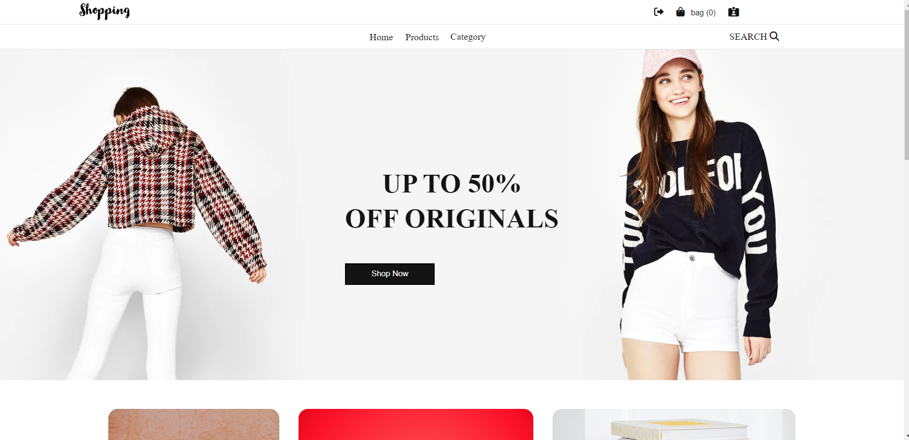
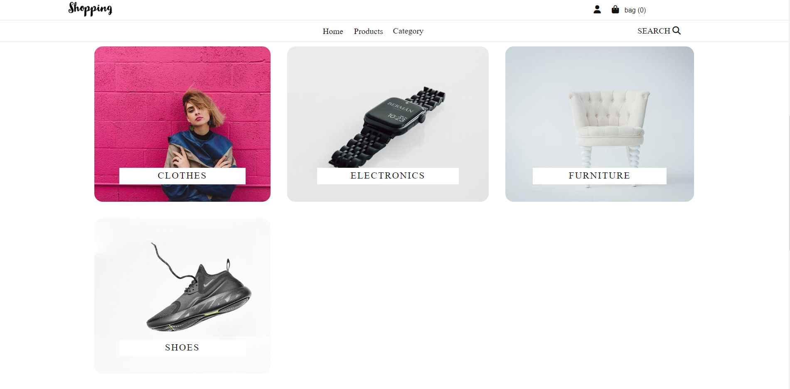
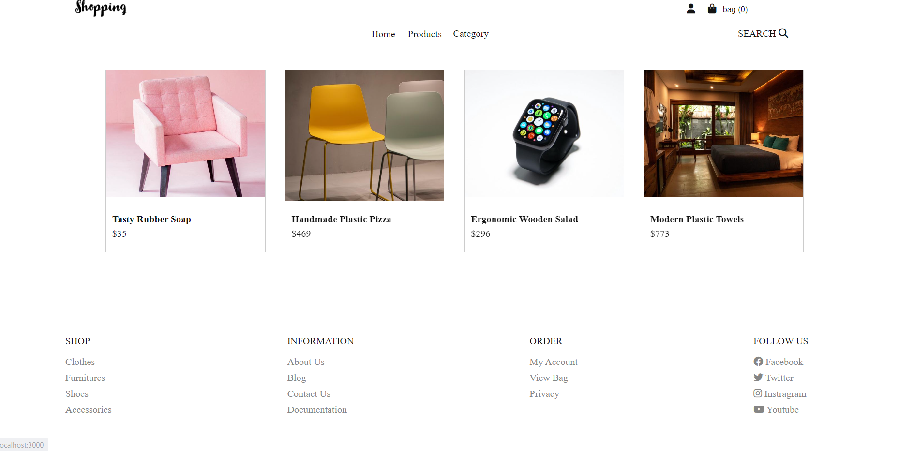
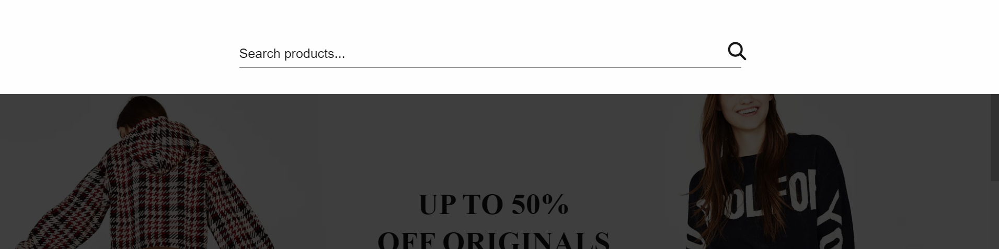
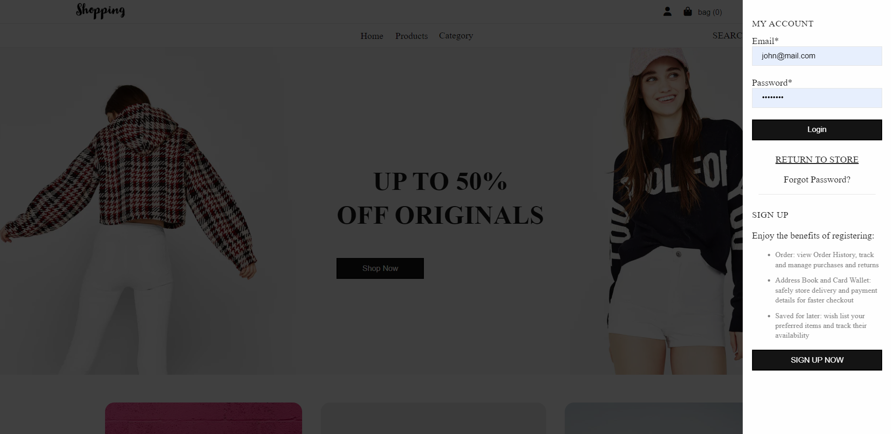
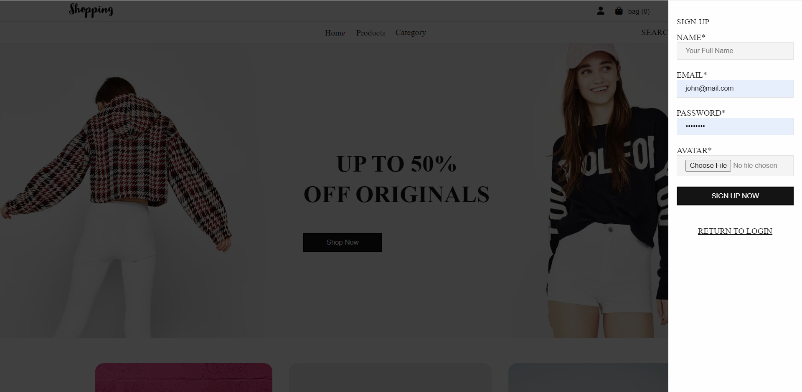
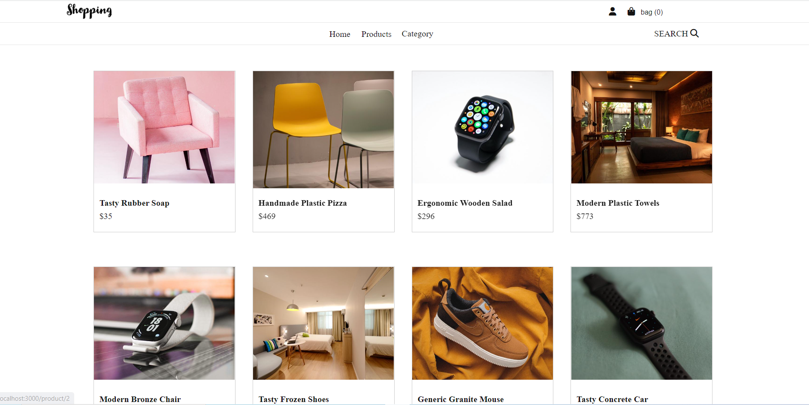
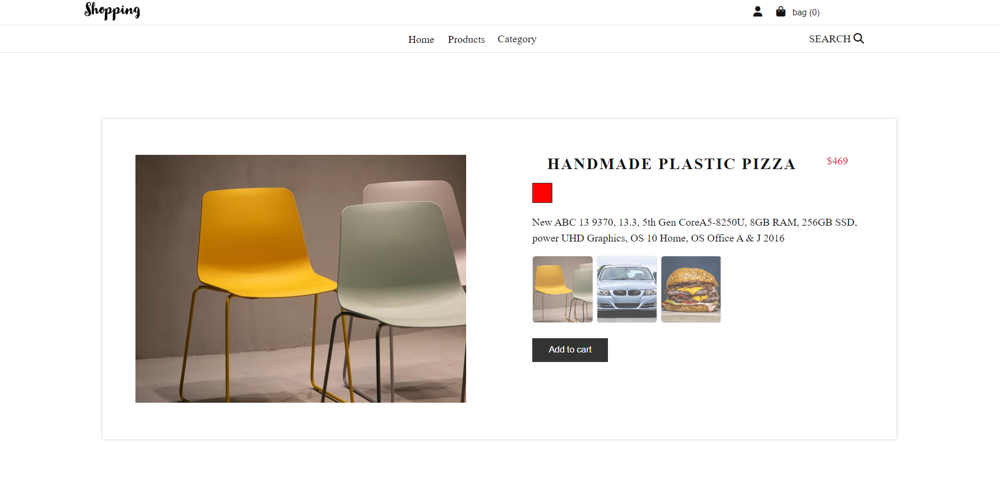
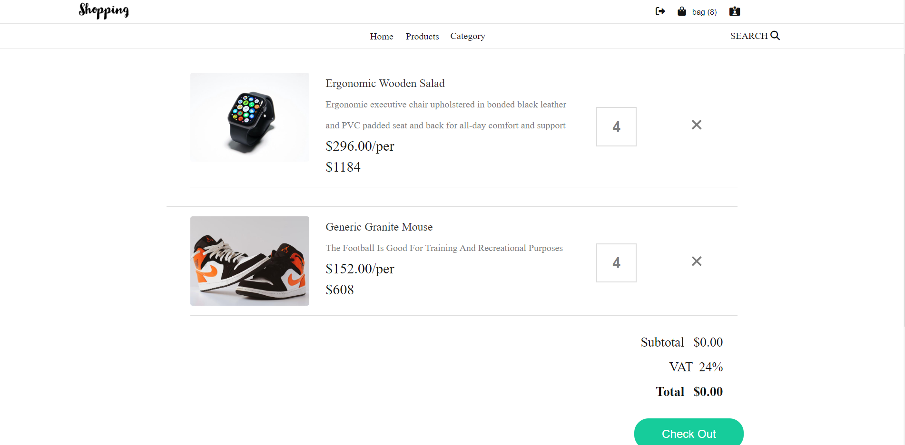
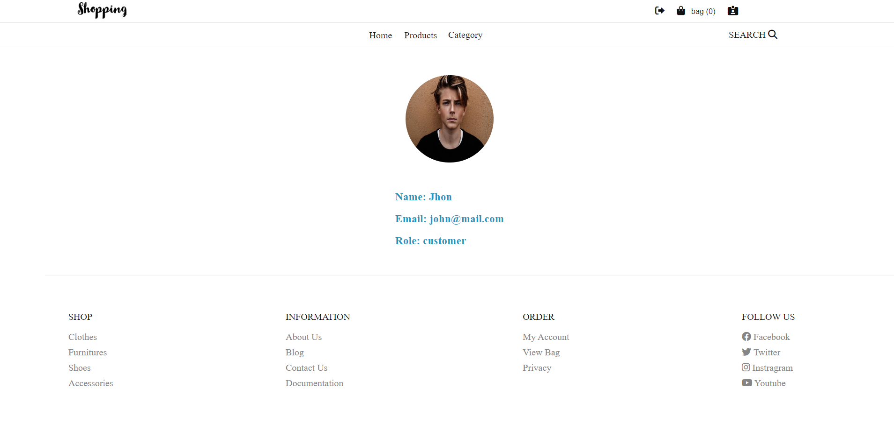

# Front-end Project


## Table of Content

- [Live Demo](#Live-Demo)
- [Current Features](#Current-Features)
- [Technologies](#Technologies)
- [Project Structure](#Project-Structur)
- [Future Work](#Future-Work)
- [Requirement](#Requirement)
- [Getting Started](#Getting-Started)
- [Result](#Result)

### Live Demo

- (https://frotend-project-ecommerce.netlify.app/)

### Current Features

- SignUp
- Login
- Product Page
- Product Details Page
- Search by Title
- Get Products by Category
- Add products to the Cart

### Technologies

- HTML5
- SCSS
- React and Redux-Toolkit
- Typescript
- Subscribe method to persist Cart data
- FakeApi(RestApi)
- Good platform for Logo design (https://express.adobe.com/express-apps/logo-maker/)

### Project Structure

```
   src
    ├───assets
    ├───components
    │   ├───Cart
    │   ├───Drawer
    │   ├───Footer
    │   ├───Header
    │   ├───Home
    │   ├───Search
    │   ├───types
    │   │   ├───auth
    │   │   ├───drawer
    │   │   ├───header
    │   │   ├───products
    │   │   └───ui
    │   └───Ui
    ├───css
    ├───hooks
    ├───pages
    ├───redux
    │   ├───actions
    │   └───slices
    └───scss
        ├───features
        ├───sections
        │   ├───cart
        │   ├───home
        │   └───product
        └───shared
            ├───inheritances
            └───variables
```

### Future Work

- Refactor the code.
- Improve the Ui design.
- Unit testing (jest)

### Requirement

1. Use the API endpoint [https://fakeapi.platzi.com/](https://fakeapi.platzi.com/) to create an e-commerce website. Read the documentation and learn how to use the different endpoints.
2. Create at lease 4 pages (can be more if you want): Home page, product page,
   profile page (only available if user logins), and cart page (cart could be a page or a modal)
3. Create Redux store for following features:
   - product reducer: get all products, find a single products, sort products by
     categories, sort products by price. Create, update and delete a product (enable update & delete features only for admin of the webapp. For example, you can check if user is your admin account before let them delete product)
   - user reducer: Register and Login
   - cart reducer: add product to cart, remove products, update products's quantity in cart
4. When adding routers to your application, programatically set certain routes to be private. For example, route to user profile page should not be accessible if user has not logged in.
5. Deploy the application and rewrite README file.

## Instruction to start the project

In the project directory, you can run:

### `npm install`

Install all the dependencies

### `npm start`

Runs the app in the development mode.\
Open [http://localhost:3000](http://localhost:3000) to view it in the browser.

The page will reload if you make edits.\
You will also see any lint errors in the console.

### `npm test`

Launches the test runner in the interactive watch mode

### `npm run build`

Builds the app for production to the `build` folder.\
It correctly bundles React in production mode and optimizes the build for the best performance.

### Result

#### `Home-Page`






#### `Signup-Login`




#### `Product-page`




#### `Cart-page`



#### `Profile-page`


